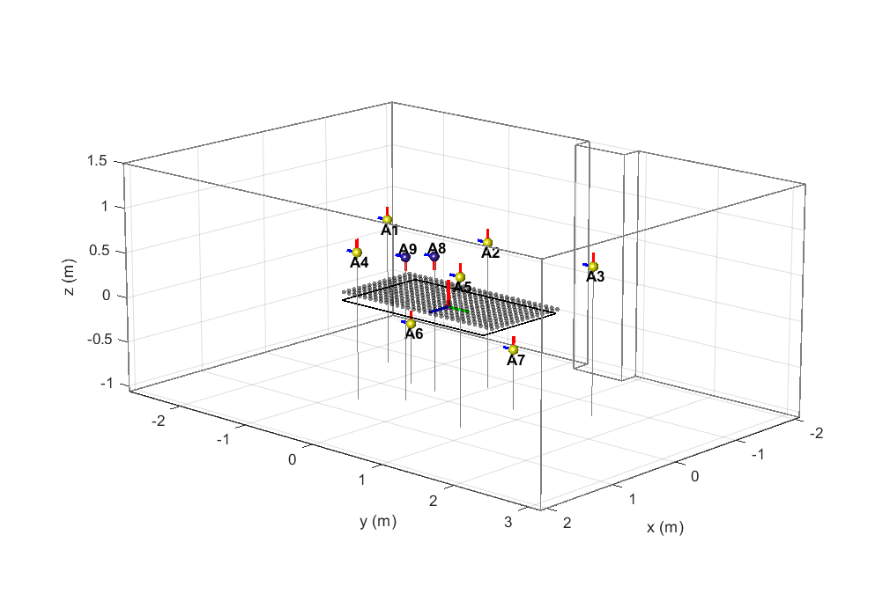
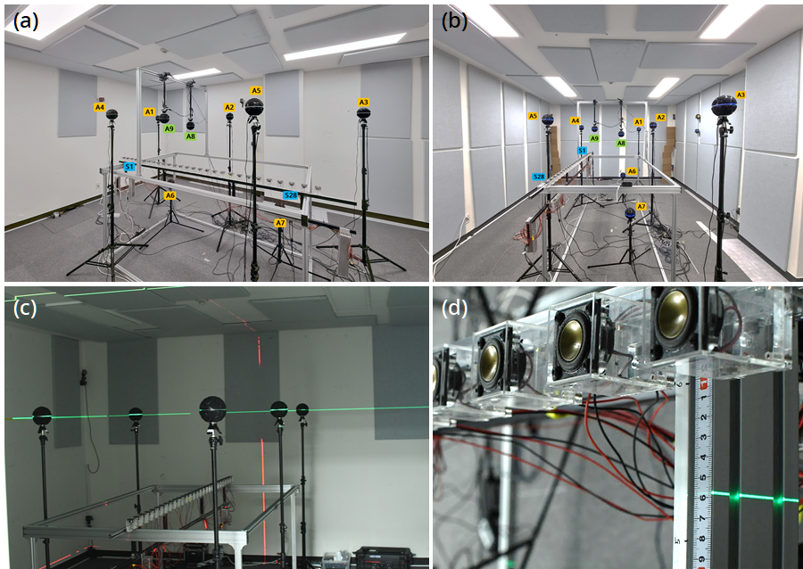
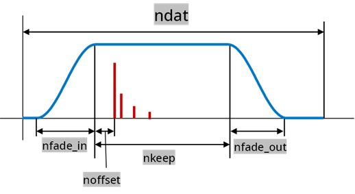
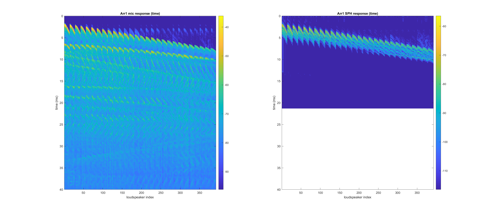
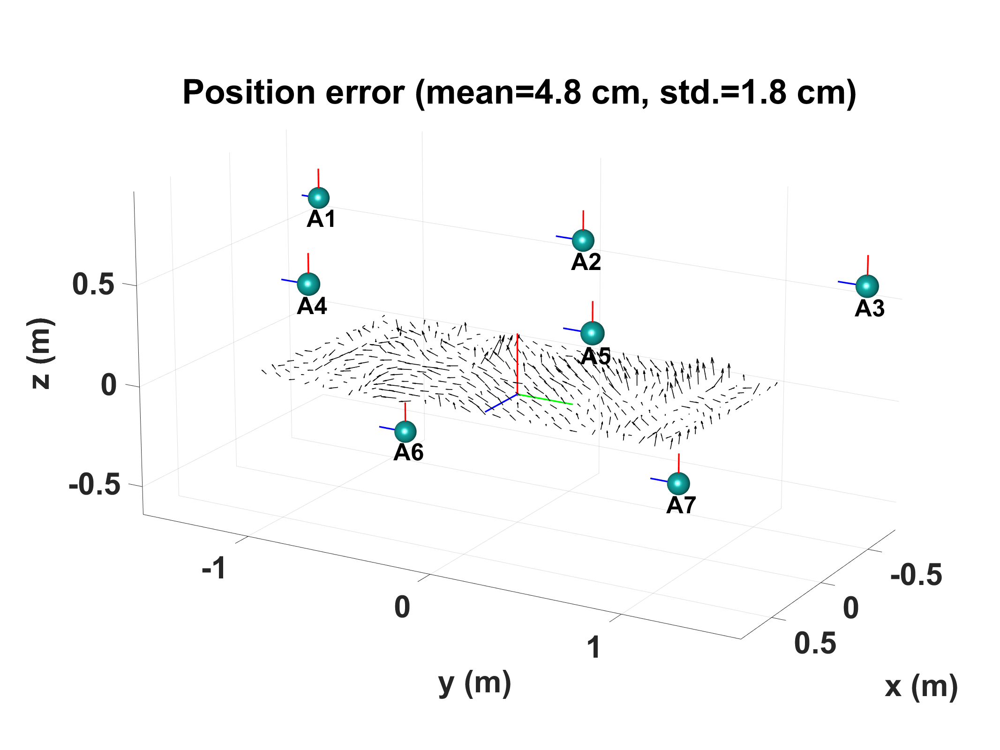

# 6DOF Directional Room Impulse Response Dataset



The 6DoF directional RIR dataset (aka **6DRIR-DL**) includes room impulse responses (RIRs) measured by **nine** spherical microphone arrays (SMAs; Zylia ZM-1S) distributed in a semi-cuboid room. **6DRIR-DL** is specialized by its massive loudspeaker positions (**392** locations), which were incorporated for the 6DOF source localization task. The inter-element spacing between loudspeakers is only 8 cm, so the dataset can be utilized to validate a sound source localization algorithm for closely positioned multiple sound sources.  

#### Authors

- Jung-Woo Choi 
  Associate Professor, Korea Advanced Institute of Science and Technology, South Korea
  [jwoo@kaist.ac.kr](mailto:jwoo@kaist.ac.kr)

- Franz Zotter
  Associate Professor, Institute of Electronic Music and Acoustics, University of Music and Performing Arts, Graz, Austria
  [zotter@iem.at](mailto:zotter@iem.at)

#### Paper ####

Details of **6DRIR-DL** can be also found in the conference paper: <a href="http://www.aes.org/e-lib/browse.cfm?elib=22184"> "Six degrees-of-freedom room impulse response dataset measured over a dense loudspeaker grid (6DRIR-DL)" </a>, presented at "International Conference on Spatial and Immersive Audio", 2023 August 23–25, Huddersfield, UK

#### License ####

<a rel="license" href="http://creativecommons.org/licenses/by/4.0/"></a> This work is licensed under a <a rel="license" href="http://creativecommons.org/licenses/by/4.0/">Creative Commons Attribution 4.0 International License</a>.

#### Download ####

The **6DRIR-DL** can be downloaded via https://zenodo.org/record/8038733 
[](https://doi.org/10.5281/zenodo.8038733)


Due to its huge size, **6DRIR-DL** is distributed as 2 sets of 9 SOFA files corresponding to 2 room conditions and 9 SMAs.

```
measurement-no-obstacles-A#.sofa
measurement-wedges-A#.sofa
```

where `no-obstacles` or `wedges` in the filename indicates the boundary condition of the measurement room. 

- `no-obstacles`: measurements were done without absorptive panels attached to the walls and absorptive wedges. 
- `wedges`:  measurement with fully attached absorptive panels and absorptive wedges stacked at four corners of the room (Fig. 1 (b))

The indices of arrays are marked as `A#`.  The auxiliary Matlab file with `.mat` extension provides environment descriptions such as vertices of the room and loudspeaker jig in the variable `Env`.  

#### Room boundary conditions

The experimental room is nearly cuboid in shape, except for a rectangular pillar sticking out of one side wall. All walls are covered with steel plates of 2 mm thickness, including the floor and ceiling. To control the long reverberation of the room, absorptive panels are attached using magnets, which allows for the modification of boundary conditions by changing the number of attached panels. In addition, we put absorptive wedges at four corners of the room to further shorten the reverberation time. 

<p>
    <br>
<em> Figure1. Measurement configurations </em>
</p>


## 1. Specification

Important measurement specifications are as follows:

- Sampling rate: 48 kHz 
- RIR length: truncated at 1/3 s (16k samples)
- `Data type:`finite impulse response `FIR`
- Room temperature: 25 Celsius degrees (speed of sound: 345.8158 m/s)
- Number of SMAs: 9 
- Number of microphones per SMA: 19 (Zylia ZM-1S)
- Radius of SMA: 54 mm
- Number of loudspeakers: 14 ($x$) $\times$ 28 ($y$) = 392 positions on a rectangular grid 
- Room dimension: (approx.) 4.18 m ($x$) $\times$ 5.97 m ($y$) $\times$ 2.56 m ($z$) 
- Coordinate center from the room corner: $(x,y,z)$=(2.09 m, 2.81 m, 1.06 m)

- Other measurement details

  - All RIRs were extracted by exponential sine sweep measurement (from 20 Hz to 24 kHz). 

  - Loudspeakers and SMAs were positioned as accurately as possible using laser guides. However, there can be errors in a few millimeters scale. 

  - Loudspeaker responses were equalized using the direct response obtained by separate measurements. 

    

## 2. SOFA files

**6DRIR-DL** dataset is distributed in a spatially oriented format for acoustics (SOFA) format v2.1[https://www.sofaconventions.org/mediawiki/index.php/SOFA_(Spatially_Oriented_Format_for_Acoustics)]. 

**Requirement**: SOFA file loader, e.g., SOFAtoolbox for Matlab (https://github.com/sofacoustics/SOFAtoolbox)

Specifically, it follows the `SingleRoomSRIR` convention, for which data fields are organized as follows:

### Coordinate system

- Global coordinates: the origin of the global coordinates was set at the center of the loudspeaker jig. 
- SMA local coordinates 
  -  In Fig. 1, the local coordinates' look direction (x-axis) and up vector (z-axis) are marked as `blue` and `red` lines, respectively. Array 1 – Array 7 were arranged in the identical direction, but Array 8 and Array 9 were rotated by $180^\circ$ around the look direction (upside down). These coordinate differences should be reflected when encoding the RIRs or for localization tasks, such as those implemented in the code: `convMeas2SPH.m` provided with the dataset. 

### Generic fields

- `API` field has size information of the measurement. 

  - `I=1`: dimension for a scalar variable 
  - `C=3`: dimension for position description (Cartesian coordinates with 3 variables: $x,~y,~z$)
  - `E=1`: number of emitters (unused)
  - `R=19`: number of receivers (number of microphone capsules in a single SMA)
  - `N=16000`: temporal length of RIRs ($1/3$ s)
  - `M=392`: total number of measurements (= $392$ loudspeaker positions)
  - `S=0`: unused

-  `Source`

  -  `SourcePosition` includes Cartesian coordinates $(x,~y,~z)$ of 392 loudspeaker positions. In the measurement, a line array of 28 loudspeakers was arranged along the $y$-axis and translated to a positive x direction in a step-by-step manner. The loudspeaker positions in the global coordinate system are recorded as 
    
$$x_i = d_x \times  \mathrm{mod}(i-1,~ 28) - D_x/2 ~~~~~ (i=1,\cdots,392)$$

$$y_i = d_y \times \lfloor(i-1)/28\rfloor - D_y/2$$
    
where $d_{x,y}=8$ cm is the interelement spacing, and $D_{x,y}$ is the span of the source grid in $x$ and $y$  directions, respectively. Note that $z_i=0.065$ m in the global coordinates. 

  - Custom-built loudspeakers (HiVi Hi-Fi B1S unit enclosed by an acryl box with internal volume 43 cc) were used.  

- `Listener`

  - The `ListenerPosition` matrix has the same size as `SourcePosition` but includes only the center position of SMA.

- `Receiver`

  - `ReceiverPosition` includes 19 microphone capsule positions in the local spherical coordinates centered at the spherical microphone array. The local spherical coordinate system follows the convention `(azimuth, elevation, radial distance)` and is described in degrees and meters, where `elevation` denotes the angle measured from the equator.  

- `Data`

  - This field includes actual RIR data and side information. 
  - `IR`: measured IRs (size`(M,R,N)=(392,19,16000)`)
  - `Delay`: unused (null matrix)
  - `SamplingRate`: 48 kHz

### Special fields

- `nstep`: number of step-by-step measurements in $x$ direction (`=14`).

- `nspk`: number of loudspeakers in the line array (`=28`).

- `numarray`: total number of SMAs used in the experiment (`=9`).

- `idxarray`: index of the present SMA file

- `temperature`, `soundspeed`, `micradius`: room temperature, speed of sound, radius of SMA, respectively.

  

## 3. Utilities

The dataset includes two MATLAB utility scripts for spherical harmonics conversion and source localization demo using MEB-ESPRIT. These scripts were tested only in Windows 64bit environment, so please modify as needed in other operating systems. 

### 3.1 Spherical harmonics conversion

The utility `convMeas2SPH.m` is the Matlab script for converting RIRs in the dataset into high-order Ambisonics (HOA) signals and storing converted signals in the `SH` SOFA format. It can also apply a temporal trimming window to the converted RIRs. For example, one can take only the direct part of RIRs in terms of the trimming window starting from the RIR peak positions estimated from the source and SMA distances stored in the input SOFA file. This utility also rotates the local coordinates of individual SMAs to obtain unified spherical harmonics (SH) encoding with respect to the global coordinates.

- Input: SOFA file of `6DRIR-DL dataset`

- Output: SOFA file of HOA signals 

- **Requirements:** 

  (1) `mtimesx` library: for matrix multiplication over tensor data
       - https://www.mathworks.com/matlabcentral/fileexchange/25977-mtimesx-fast-matrix-multiply-with-multi-dimensional-support
  
  (2) `Spherical array processing toolboxes` by Archontis Politis 
       - https://github.com/polarch/Spherical-Array-Processing
       - https://github.com/polarch/Array-Response-Simulator
       - https://github.com/polarch/Spherical-Harmonic-Transform
  (Archontis Politis, Microphone array processing for parametric  spatial audio techniques, 2016,  Doctoral Dissertation, Department of Signal Processing and Acoustics, Aalto University, Finland)

- Hyperparameters

  - `btrim`: if `true`, generate and apply a trimming window to RIRs. 
    The trimming window extracts a part of RIR around its direct wave. The position of a direct wave arrival is determined by the geometry of SMA and loudspeakers. The trimming window is defined by four parameters: `Ttrim`, `nfadein`,`nfadeout`, and `noffset`. RIRs multiplied with the trimming window are truncated to the length `ndat`. 
  
    - `ndat`: total length of trimmed RIR
    - `nkeep`: length of the non-tapered interval. Determined by `nkeep`=`Ttrim` $\times$ `c0` / `fs`
  
    
  
  - `bplot`: if `true`, the code plots RIRs after encoding. The first sub-figure presents the squared sum of all microphone responses in the input SOFA file plotted with respect to the loudspeaker positions (abscissa)  and time (ordinate). The second sub-figure is the plot of the `W` channel response after the SH encoding and trimming. The following figures present the original and trimmed RIRs.
  
  
  
  - `tag`: extra tag to be added to the file name for saving
  
  - `measname`: name of measurement (e.g., `measurement-no-obstacles` or `measurement-wedges`)
  
  - Spherical harmonics encoding parameters
  
    -  `N` is the maximum order of spherical harmonics encoding. When generating the encoding filter of `nenc` samples, the maximum gain for equalizing individual order responses is limited to  `sn`  in the dB scale. 
    
    

### 3.2 MEB-ESPRIT utility (simple version)

The utility script `MEBESPRIT.m` in the `utility` folder demonstrates the basic estimation of source positions from multiple SMA recordings. The script directly constructs the total covariance matrix between multiple SMA RIRs in the frequency domain, with the assumption that sources are driven by uncorrelated white noises. 

The input to this script is the SH SOFA file produced from `convMeas2SPH.m` .  The following is an example of single-source localization using 7 SMAs and RIRs trimmed only for the direct responses. Estimation errors for all 392 sources are displayed as a vector field. 




